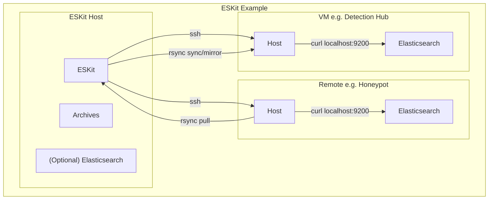

# ESKit

ESKit is a lightweight command-line toolkit for managing Elasticsearch repositories, snapshots, indices, and reindex operations across multiple environments.

It is designed for operators who regularly work with snapshot-based backup and restore workflows and want a simple, cache-driven interface instead of repeatedly typing Elasticsearch API requests.

> ⚠️ **Status: Work in Progress (WIP)**\
> Snapshot, repository, index, and rsync-based repository archiving workflows are stable and actively
> used in personal environments.\
> Advanced job tracking is still in development.

---

## Why ESKit?

Managing Elasticsearch snapshots often involves repetitive API calls:

- List repositories
- List snapshots
- Create snapshots
- Restore snapshots
- Delete indices
- Reindex data
- Check restore progress

Design Philosophy:
- For repeatable operational workflows
- Fail-safe by default
- No direct cluster coupling
- Explicit destructive operations
- Cache-first visibility
- SSH as the only control plane

ESKit provides a consistent CLI workflow:

1. Pull cluster metadata into a local cache
2. Browse repositories, snapshots, and indices locally
3. Execute Elasticsearch operations through SSH
4. Track long-running jobs such as reindex tasks

---

## Features

### Repository Management

- Create snapshot repositories
- Delete repositories
- View repository configuration
- Browse cached repository information

### Snapshot Management

- Create snapshots
- Delete snapshots
- Restore snapshots
- View snapshot details
- Browse cached snapshot metadata

### Index Management

- Create indices
- Delete indices
- View mappings and settings
- Browse cached index information

### Reindex Operations

- Start asynchronous reindex jobs
- Store job metadata locally
- Track Elasticsearch task IDs

### Archive Management
- Synchronize data with rsync
    - Treats data on the ESKit host as a managed archive
    - Create an archive with remote host data
    - Transfer archive data to another local or remote location
- Support operations
    - Incremental update by keeping local data
    - Synchronized update or mirroring with source data

### Cache System

ESKit maintains a local cache for:

- Repositories
- Snapshots
- Indices
- Cluster Version
- Archives
```text
.eskit/
├── jobs (archive-related jobs)
|     └── <job_id>.json
└── <host>/
    └── cache/
        ├── indices.json
        ├── repos.json
        ├── snapshots.json
        ├── version.json
        ├── jobs
        |     └── <job_id>.json
        └── archives
              └── <archive_name>.json
```
This allows fast inspection without repeatedly querying Elasticsearch.

### Views and Field Projection

Output can be customized using reusable views defined in the configuration file.

Examples:

```bash
eskit cat index --view basic
eskit repo show backup-repo --view summary
eskit index show logs-2026.06 --fields mappings.properties
```

---

## Architecture

ESKit communicates with Elasticsearch through SSH.


- No Elasticsearch Python client is required.
- Elasticsearch is accessed locally on each host via curl localhost:9200 over SSH, so ESKit does not require a TLS-enabled client connection to the cluster.
- ESKit host can synchronize data from the remote host for archiving and transferring it to another host.
- Centralizes archive synchronization on the ESKit host, eliminating the need to configure direct data transfer between non-ESKit hosts.
- For snapshot archives, an optional local Elasticsearch cluster can be deployed on the ESKit host to inspect and manage archived snapshot repositories.
---

## SSH Login

This tool supports connecting to hosts with SSH by using paramiko. Currently, it supports:
- Key authentication
- Password authentication

For key authentication, it supports SSH-Agent, a Runtime passphrase prompt (Ed25519Key only), or an unencrypted key. It's highly recommended to utilize SSH-Agent to avoid repeated passphrase prompts.

For password authentication, it currently does not support environment variables, so passwords need to be in the config file. This is intended primarily for lab and development environments.

### Security Notes

- SSH key authentication is recommended.
- Password authentication is supported primarily for lab and development environments.
- Production deployments should use SSH keys or SSH-Agent where possible.
- Do not commit `.eskit/config.json` to source control.
- Archive operations that use password authentication
may require `sshpass` to be installed on the ESKit host.

### SSH Authentication (Recommended)

ESKit supports SSH key authentication through `ssh-agent`. Using `ssh-agent` avoids storing SSH passwords in configuration files and allows passphrase-protected keys to be unlocked once per session.

#### Start `ssh-agent`

Linux/macOS/WSL:

```bash
eval "$(ssh-agent -s)"
```

Example output:

```text
Agent pid 12345
```

#### Add an SSH Key

Default keys:

```bash
ssh-add ~/.ssh/id_ed25519
```

or

```bash
ssh-add ~/.ssh/id_rsa
```

Custom key:

```bash
ssh-add ~/.ssh/my_private_key
```

If the key is passphrase protected, you will be prompted to enter the passphrase once:

```text
Enter passphrase for /home/user/.ssh/id_ed25519:
```

#### Verify Loaded Keys

```bash
ssh-add -l
```

Example output:

```text
256 SHA256:xxxxxxxxxxxxxxxxxxxxxxxxxxxxxxxx user@host (ED25519)
```

Once a key is loaded into `ssh-agent`, ESKit and Paramiko can automatically use it for SSH connections without requiring passwords or repeated passphrase prompts.

---

## Installation

### Requirements

-   Python 3.9+
-   paramiko
- `rsync` (required for archive features; available on Linux, macOS, WSL, and environments such as MinGW/MSYS2 or Cygwin on Windows)

### Setup

Clone the repository:

```bash
git clone <repo-url>
cd eskit
```

### User Set-up (Recommended)

Install pipx:

Linux/Ubuntu/WSL
```bash
sudo apt install pipx
pipx ensurepath
```

macOS
```bash
brew install pipx
pipx ensurepath
```

Run Pipx
```bash
pipx install .
eskit --help
```

### Development Set-up

Create VEnv: 

Linux/macOS/WSL
```bash
python3 -m venv .venv
source .venv/bin/activate
```

Windows:
```powershell
python -m venv .venv
.venv\Scripts\Activate.ps1
```

Pip install:
```bash
pip install -e .
eskit --help
```

---

Running:

```bash
eskit --help
```
```bash
eskit init --demo
```

## Quick Demo
```bash
git clone ...
cd eskit

pipx install .

eskit init --demo
eskit status
eskit cat repo
```

### What you can do with the demo
In the demo, you can explore how eskit works out of the box:
- You can view cached data with commands.
- You can try to use the --dry-run option on commands that would modify data on the host side. The option will give you a preview of the Elasticsearch API request.

Also, you could extend the configuration to your host and try.

## Uninstall

### pipx Installation

```bash
pipx uninstall eskit
```

### Development Installation (virtual environment)

Deactivate and remove the virtual environment:

```bash
deactivate
rm -rf .venv
```

If installed into an active virtual environment:

```bash
pip uninstall eskit
```

> Removing ESKit does not automatically remove local workspaces (e.g. `.eskit/` cache directories or archives) created by `eskit init`. Remove them manually if no longer needed.

---

## Command Overview

#### Initialize ESKit

```bash
eskit init
```

This creates an initial config file.

#### Initialize Demo
```bash
eskit init --demo
```

This initializes with a demo cache file to explore the tool.

### Select a Host

```bash
eskit host show
eskit host set prod
eskit host get
```

### Show ESKit Status

```bash
eskit status
```
- Data Source: Config | Cache
This command shows the host information, including the Elasticsearch cluster information in cache.

### Pull Metadata

```bash
eskit pull
```
- Data Source: Elasticsearch

---

## View Metadata
```bash
eskit cat <repo/snap/index>
```
- Data Source: Cache
- Operation Type: View

This shows the metadata in cache.

## Repository Workflow

Create a repository:

```bash
eskit repo create backup-repo \
  --location /data/snapshots
```
- Data Destination: Elasticsearch
- Operation Type: Mutating

Show repository or snapshot information:

```bash
eskit repo show backup-repo
eskit repo show backup-repo/snapshot1
```
- Data Source: Cache
- Operation Type: View

Delete a repository:

```bash
eskit repo delete backup-repo
```
- Data Destination: Elasticsearch
- Operation Type: Mutating | Destructive

---

## Snapshot Workflow

Create a snapshot:

```bash
eskit snap create backup-repo/nightly-2026.06.01
```
- Data Destination: Elasticsearch
- Operation Type: Mutating
- You can use **--index** option to speicify which indices to include.
> ⚠️ **Wildcard Note**\
> You may use a wildcard in the index name, but I observed that Elasticsearch would include hidden indices that match the expression. You may exclude such indices during restoration by explicitly specifying the index name.

Restore a snapshot:

```bash
eskit snap restore backup-repo/nightly-2026.06.01
```
- Data Destination: Elasticsearch
- Operation Type: Mutating

Delete a snapshot:

```bash
eskit snap delete backup-repo/nightly-2026.06.01
```
- Data Destination: Elasticsearch
- Operation Type: Mutating | Destructive

---

## Index Workflow

Create an index:

```bash
eskit index create test-index
```
- Data Destination: Elasticsearch
- Operation Type: Mutating

Delete an index:

```bash
eskit index delete test-index
```
- Data Destination: Elasticsearch
- Operation Type: Mutating | Destructive

Show index information:

```bash
eskit index show test-index
```
- Data Source: Elasticsearch
- Operation Type: View

Check index status (after restoring snapshot):

```bash
eskit index status test-index
```
- Data Source: Elasticsearch
- Operation Type: View

---

## Reindex Workflow

Start a reindex operation:

```bash
eskit reindex source-index destination-index
```
- Data Source: Elasticsearch
- Operation Type: Mutating

Check jobs:

```bash
eskit job list
```
- Data Source: Cache
- Operation Type: View

Show a job:

```bash
eskit job show <job-id>
```
- Data Source: Cache
- Operation Type: View

Check the Elasticsearch task status:

```bash
eskit task get <task-id>
```
- Data Source: Elasticsearch
- Operation Type: View

---

## Archive Workflow

Archive Config:
```json
{
"host": "RemoteHost",
...
"archives":[
  {"type": "snapshot", "name": "snapshots", "remote_src":"/home/zach/snapshots", "local_dst": "snapshots",
  }
            ]
...
}
```
- Remote host is resolved automatically.

Synchronize data with a remote host incrementally:

```bash
eskit archive pull <archive-name>
```
- Data Source: Remote Host
- Operation Type: Mutating(local host archive)
- Use --contents option to synchronize only the contents to avoid creating the top-level folder.

Synchronize data with a remote host by mirroring:

```bash
eskit archive sync <archive-name>
```
- Data Source: Remote Host
- Operation Type: Mutating(local host archive) | Destructive(local host archive)
- Use --contents option to synchronize only the contents to avoid creating the top-level folder.

Transfer data to another host or within the local host:
```bash
eskit archive push <archive-name> --dst <target location>
```
- Data Source: Local Archive
- Operation Type: Mutating(target location) | Destructive(target location)
- Use --contents option to synchronize only the contents to avoid creating the top-level folder.
- This operation performs mirroring, which could delete the target location's data depending on the archive updates on the local host.
- Target location format:
For a Remote Host:
```bash
<ESKit Host Name>:<path>
e.g. VM-Host:/home/mike/snapshot
```
For a local location:
```bash
<path>
e.g. /home/mike/snapshot
```
ESKit resolved the hostname based on the host configuration.

List archive cache:
```bash
eskit archive list
```
- Data Source: Cache
- Operation Type: View

Show specific archive in cache:
```bash
eskit archive show <archive-name>
```
- Data Source: Cache
- Operation Type: View

### Elasticsearch Compatibility Overview

| Artifact              | Older → Newer Version                            | Newer → Older Version   |
| --------------------- | ------------------------------------------------ | ----------------------- |
| Live data directory   | Usually supported                                | Generally not supported |
| Snapshot repository   | Often supported within documented version limits | Generally not supported |
| Lucene index segments | Typically readable by newer versions             | Frequently unsupported  |

> **Note:** Elasticsearch upgrades should generally be treated as one-way operations. Once a newer version writes data, metadata, or snapshots, older versions may no longer be able to read or restore them.

> Version information is available in the host version, snapshot, and index cache which can be used to determine compatibility for different Elasticsearch cluster. 

### Elasticsearch Index Version IDs

ESKit caches the raw `index.version.created` value reported by Elasticsearch. This value is an internal Elasticsearch version identifier and may not directly correspond to the semantic version string.

Example:

```json
{
  "version": {
    "created": 9023001
  }
}
```

For the official mapping between version identifiers and Elasticsearch releases, refer to:

https://github.com/elastic/elasticsearch/blob/main/server/src/main/resources/org/elasticsearch/index/IndexVersions.csv

ESKit currently stores the raw version identifier as the source of truth and does not perform version resolution or compatibility analysis.

---

## Local Host Workflow

An optional local Elasticsearch cluster can be deployed on the ESKit host to inspect and restore snapshot archives.

A sample docker-compose.yml is located at:
```bash
<root_dir>/docker
```

The local host config can be defined as:
```json
{
  "name": "LocalHost",
  "localhost": true
}
```
ESKit treats the local host as another configured host and executes Elasticsearch commands directly on the local machine instead of through SSH.

Please note that ESKit does not manage the Elasticsearch cluster itself, so make sure to set up the repo config in the Dockerfile and specify the physical location of the repo to be managed or updated, depending on your environment. 

---

## Output Views

Views provide reusable output projections for commands that return metadata.

Example:

```json
{
  "views": {
    "snapshot-basic": [
      "snapshot",
      "state",
      "start_time",
      "end_time"
    ]
  }
}
```

Usage:

```bash
eskit cat snap --view snapshot-basic
```

Multiple views may be specified:

```bash
eskit cat snap \
  --view snapshot-basic \
  --view snapshot-stats
```

Additional fields can be included:

```bash
eskit cat snap \
  --view snapshot-basic \
  --fields duration_in_millis
```

Please check the command argument to see whether the --view or --fields options are supported.
Also, the config file in the demo or template shows some sample view configurations.

#### Example:
Before applying the view:
```bash
eskit cat index
```
```json
[
  ...
  {
    "health": "yellow",
    "status": "open",
    "index": "metric-2026.05.18",
    "uuid": "o0C_RTpaSJme0se-n3LWkQ",
    "pri": "1",
    "rep": "1",
    "docs.count": "169875",
    "docs.deleted": "0",
    "store.size": "127mb",
    "pri.store.size": "127mb",
    "dataset.size": "127mb"
  }
  ...
]
```

After applying the view:
```json
"cat-index-basic":[
    "index",
    "health",
    "status",
    "docs$count",
    "store$size"
]
```
* Please note that if the fields contain the period "." in the name, please replace it with "$".
```bash
eskit cat index --view cat-index-basic
```
```json
[
  ...
  {
    "index": "metric-2026.05.18",
    "health": "yellow",
    "status": "open",
    "docs.count": "169875",
    "store.size": "127mb"
  }
  ...
]
```

---

## Safety Features

### Push Protection

Hosts may be marked as protected:

```json
{
  "name": "prod",
  "push-protected": true
}
```

Mutating operations require:

```bash
--push
```

Example:

```bash
eskit repo create backup-repo \
  --push
```

### Dry Run

Preview requests without executing them:

```bash
eskit snap create backup-repo/test \
  --dry-run
```

### Delete Confirmation

Destructive operations require confirmation unless:

```bash
--force
```

is specified.

---

## Configuration

Create:

```text
.eskit/config.json
```

Example:

```json
{
  "hosts": [
    {
      "name": "prod",
      "ip": "10.0.0.10",
      "push-protected": true,
      "ssh": {
        "user": "elastic",
        "identity": "~/.ssh/id_ed25519"
      }
    }
  ]
}
```

---

## Operation Workflow Example
This is how I use the eskit to perform my repository/snapshot workflow for my other project.

##### 1. Double-check which host I am working on.
```
eskit host get
eskit host set <host>
```
##### 2. Check the status of the host that I would like to operate on.
```bash
eskit status
```
##### 3. Pull the latest information.
```bash
eskit pull
```
##### 4. Check available indices
```bash
eskit cat index
```
##### 5. Create a snapshot
```bash
eskit snap create --index *2026.05.31* daily_repo/2026.05.31
```
- Wildcard is supported.
- The mutating operation will automatically update the cache after successful execution.

##### 6. Verify the created snapshot with the intended indices and state, etc.
```bash
eskit repo show daily_repo/2026.05.31 --view snapshot-basic
or
eskit cat snap --view snapshot-basic # returns list of snapshots
```
- You may need to wait until the **state** becomes **SUCCESS** by pulling data again.
- Optionally, you can use "view" to control what information is returned.

##### 7. Synchronize the snapshot from the host to my other host for restoration.

Newly created command can be used to perform the syncronization from the ESKit host and a remote host instead of using rysnc command directly.

```bash
eskit archive pull snapshots --contents
```

> ⚠️ **Archive/Rsync Note**\
> After a successful archive/rsync operation, you may need to delete the repository on the destination host side to reflect the update. That's the behavior I observed so far. Although the repository is deleted, snapshots remain.
> ```bash
> eskit repo delete <repo>
> eskit repo create <repo> --location abc
> ```

##### 8. Restore the snapshot for my other host.
* Make sure to change the host if you are operating on a single folder for multiple hosts.
```bash
eskit host set <host>
```
```bash
eskit snap restore daily_repo/2026.05.31
```

##### 9. Check the index status for restore completion.
```bash
eskit index status logs-2026.05.31
```
It will display data such as "bytes_percent" and "stage" to verify the restoration status.

Typical workflow ends here, but I ran one more step to reindex the restored index.

##### 10. Run the reindex command
For my specific use case, I will change the index's timestamp format.
```bash
eskit reindex -m timestamp-mapping logs-2026.05.31 logs-2026.05.31-ts-format-fix
```
Since reindexing can take time, it's requested without waiting for the job to complete. The command will create a cache file for a job/task and output a job ID that can be used to retrieve the job information in the cache. e.g. host/cache/jobs/job_id.json.

- Currently, eskit doesn't support updating job status since it's created, so you would need to use a command to get the status.

```bash
eskit task get iJB85gfpT2uErgzlMvmJbA:2176368  
```
You can check "status.total", "status.created", and "completed" to see progress.

##### 11. Once completed and verified, I will delete the original index.
```bash
eskit index delete logs-2026.05.31
```

## Limitations
- This tool has been tested with the Elasticsearch/Kibana version of 9.2.3.

---

## Future Updates and Improvements
- Automatic snapshot compatibility validation.
- Continuous task monitoring/polling.
- Streaming logs for long-running operations.
- Shell interactive mode.

---

## Project Goals

ESKit is intended to remain:

- Lightweight
- Scriptable
- SSH-first
- Dependency-light
- Focused on operational workflows rather than full Elasticsearch administration

The goal is not to replace Kibana or official Elasticsearch tooling, but to provide a fast command-line workflow for snapshot, restore, and migration tasks.

## Roadmap

Planned or under consideration:

- Centralized Logging and Logging level feature
- Enhanced error checking and operation pre-flight checker
- Optional desktop UI for management workflows

## License

This project is licensed under the MIT License. See the LICENSE file for details.