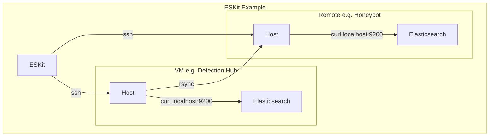

# ESKit

ESKit is a lightweight command-line toolkit for managing Elasticsearch repositories, snapshots, indices, and reindex operations across multiple environments.

It is designed for operators who regularly work with snapshot-based backup and restore workflows and want a simple, cache-driven interface instead of repeatedly typing Elasticsearch API requests.

> --Status:-- Work in Progress (WIP)
>
> Core snapshot and index management workflows are operational and actively used. Rsync-based repository synchronization is still under development.

---

## Why ESKit?

Managing Elasticsearch snapshots often involves repetitive API calls:

- List repositories
- List snapshots
- Create snapshots
- Restore snapshots
- Delete indices
- Reindex data
- Check restore progress

ESKit provides a consistent CLI workflow:

1. Pull cluster metadata into a local cache
2. Browse repositories, snapshots, and indices locally
3. Execute Elasticsearch operations through SSH
4. Track long-running jobs such as reindex tasks

---

## Features

### Repository Management

- Create snapshot repositories
- Delete repositories
- View repository configuration
- Browse cached repository information

### Snapshot Management

- Create snapshots
- Delete snapshots
- Restore snapshots
- View snapshot details
- Browse cached snapshot metadata

### Index Management

- Create indices
- Delete indices
- View mappings and settings
- Browse cached index information

### Reindex Operations

- Start asynchronous reindex jobs
- Store job metadata locally
- Track Elasticsearch task IDs

### Cache System

ESKit maintains a local cache for:

- Repositories
- Snapshots
- Indices
- Cluster Version

This allows fast inspection without repeatedly querying Elasticsearch.

### Views and Field Projection

Output can be customized using reusable views defined in the configuration file.

Examples:

```bash
eskit cat index --view basic
eskit repo show backup-repo --view summary
eskit index show logs-2026.06 --fields mappings.properties
```

---

## Architecture

ESKit communicates with Elasticsearch through SSH.


- No Elasticsearch Python client is required.
- API requests are executed remotely using curl to localhost.
- No TLS required on Elasticsearch

---

## Installation

Clone the repository:

```bash
git clone <repo-url>
cd eskit
```

Install dependencies:

```bash
pip install paramiko
```

Running:

```bash
python eskit.py --help
```
```bash
python eskit.py init --demo
```

---

## Quick Demo
```bash
git clone ...
cd eskit

pip install paramiko

python eskit.py init --demo
python eskit.py status
python eskit.py cat repo
```

### What you can do with the demo
In the demo, you can explore how eskit works out of the box:
- You can view cached data with commands.
- You can try to use the --dry-run option on commands that would modify data on the host side. The option will give you a preview of the Elasticsearch API request.

Also, you could extend the configuration to your host and try.

---

## Command Overview

#### Initialize ESKit

```bash
eskit init
```

This creates an initial config file.

#### Initialize Demo
```bash
eskit init --demo
```

This initializes with a demo cache file to explore the tool.

### Select a Host

```bash
eskit host show
eskit host set prod
eskit host get
```

### Show ESKit Status

```bash
eskit status
```
- Data Source: Config | Cache
This command shows the host information, including the Elasticsearch cluster information in cache.

### Pull Metadata

```bash
eskit pull
```
- Data Source: Elasticsearch

This updates the local cache:

```text
.eskit/
└── prod/
    └── cache/
        ├── indices.json
        ├── repos.json
        ├── snapshots.json
        └── version.json
```

---

## View Metadata
```bash
eskit cat <repo/snap/index>
```
- Data Source: Cache
- Operation Type: View

This shows the metadata in cache.

## Repository Workflow

Create a repository:

```bash
eskit repo create backup-repo \
  --location /data/snapshots
```
- Data Destination: Elasticsearch
- Operation Type: Mutating

Show repository or snapshot information:

```bash
eskit repo show backup-repo
eskit repo show backup-repo/snapshot1
```
- Data Source: Cache
- Operation Type: View

Delete a repository:

```bash
eskit repo delete backup-repo
```
- Data Destination: Elasticsearch
- Operation Type: Mutating | Destructive

---

## Snapshot Workflow

Create a snapshot:

```bash
eskit snap create backup-repo/nightly-2026.06.01
```
- Data Destination: Elasticsearch
- Operation Type: Mutating

Restore a snapshot:

```bash
eskit snap restore backup-repo/nightly-2026.06.01
```
- Data Destination: Elasticsearch
- Operation Type: Mutating

Delete a snapshot:

```bash
eskit snap delete backup-repo/nightly-2026.06.01
```
- Data Destination: Elasticsearch
- Operation Type: Mutating | Destructive

---

## Index Workflow

Create an index:

```bash
eskit index create test-index
```
- Data Destination: Elasticsearch
- Operation Type: Mutating

Delete an index:

```bash
eskit index delete test-index
```
- Data Destination: Elasticsearch
- Operation Type: Mutating | Destructive

Show index information:

```bash
eskit index show test-index
```
- Data Source: Elasticsearch
- Operation Type: View

Check index status (after restoring snapshot):

```bash
eskit index status test-index
```
- Data Source: Elasticsearch
- Operation Type: View

---

## Reindex Workflow

Start a reindex operation:

```bash
eskit reindex source-index destination-index
```
- Data Source: Elasticsearch
- Operation Type: Mutating

Check jobs:

```bash
eskit job list
```
- Data Source: Cache
- Operation Type: View

Show a job:

```bash
eskit job show <job-id>
```
- Data Source: Cache
- Operation Type: View

Check the Elasticsearch task status:

```bash
eskit task get <task-id>
```
- Data Source: Elasticsearch
- Operation Type: View

---

## Output Views

Views provide reusable output projections for commands that return metadata.

Example:

```json
{
  "views": {
    "snapshot-basic": [
      "snapshot",
      "state",
      "start_time",
      "end_time"
    ]
  }
}
```

Usage:

```bash
eskit cat snap --view snapshot-basic
```

Multiple views may be specified:

```bash
eskit cat snap \
  --view snapshot-basic \
  --view snapshot-stats
```

Additional fields can be included:

```bash
eskit cat snap \
  --view snapshot-basic \
  --fields duration_in_millis
```

Please check the command argument to see whether the --view or --fields options are supported.
Also, the config file in the demo or template shows some sample view configurations.

#### Example:
Before applying the view:
```bash
python eskit.py cat index
```
```json
[
  ...
  {
    "health": "yellow",
    "status": "open",
    "index": "metric-2026.05.18",
    "uuid": "o0C_RTpaSJme0se-n3LWkQ",
    "pri": "1",
    "rep": "1",
    "docs.count": "169875",
    "docs.deleted": "0",
    "store.size": "127mb",
    "pri.store.size": "127mb",
    "dataset.size": "127mb"
  }
  ...
]
```

After applying the view:
```json
"cat-index-basic":[
    "index",
    "health",
    "status",
    "docs$count",
    "store$size"
]
```
* Please note that if the fields contain the period "." in the name, please replace it with "$".
```bash
python eskit.py cat index --view cat-index-basic
```
```json
[
  ...
  {
    "index": "metric-2026.05.18",
    "health": "yellow",
    "status": "open",
    "docs.count": "169875",
    "store.size": "127mb"
  }
  ...
]
```

---

## Safety Features

### Push Protection

Hosts may be marked as protected:

```json
{
  "name": "prod",
  "push-protected": true
}
```

Mutating operations require:

```bash
--push
```

Example:

```bash
eskit repo create backup-repo \
  --push
```

### Dry Run

Preview requests without executing them:

```bash
eskit snap create backup-repo/test \
  --dry-run
```

### Delete Confirmation

Destructive operations require confirmation unless:

```bash
--force
```

is specified.

---

## Configuration

Create:

```text
.eskit/config.json
```

Example:

```json
{
  "hosts": [
    {
      "name": "prod",
      "ip": "10.0.0.10",
      "push-protected": true,
      "ssh": {
        "user": "elastic",
        "identity": "~/.ssh/id_ed25519"
      }
    }
  ]
}
```

---

## Operation Workflow Example
This is how I use the eskit to perform my repository/snapshot workflow for my other project.

1. Double-check which host I am working on.
```
python eskit.py host get
python eskit.py host set <host>
```
2. Check the status of the host that I would like to operate on.
```bash
python eskit.py status
```
3. Pull the latest information.
```bash
python eskit.py pull
```
4. Check available indices
```bash
python eskit.py cat index
```
5. Create a snapshot
```bash
python eskit.py snap create --index *2026.05.31* daily_repo/2026.05.31
```
- Wildcard is supported.
- Modifying operation will automatically update the cache after successful execution.


6. Verify the created snapshot with the intended indices and state, etc.
```bash
python eskit.py repo show daily_repo/2026.05.31
```
- Optionally, you can use "view" to control what information is returned.

7. Synchronize the snapshot from the host to my other host for investigation.
I use rsync for this operation, but currently eskit does not support it.
So I manually run the command on the host.
```bash
sudo rsync -av --progress -e "ssh -p 22 -i .ssh/id_ed22519" demo@<ip>:/home/demo/data/elk/snapshot /home/demo/data/elk
```
8. Restore the snapshot for my other host.
* Make sure to change the host if you are operating on a single folder for multiple hosts.
* Also, you can use the "push-protection" flag in the host configuration to avoid accidental command executions. For destructive operations such as deletion, it's protected by requiring an input from the operator. You can use "--force" to bypass the confirmation, but please be careful.
```base
python eskit.py host set <host>
```
```base
python eskit.py snap restore daily_repo/2026.05.31
```

9. Check index status for restore completion.
```bash
python eskit.py index status logs-2026.05.31
```
It will display data such as "bytes_percent" and "stage" to verify the restoration status.

Typical workflow ends here, but I ran one more step to reindex the restored index.

10. Run the reindex command
For my specific use case, I will change the index's timestamp format.
```bash
python eskit.py reindex -m timestamp-mapping logs-2026.05.31 logs-2026.05.31-ts-format-fix
```
Since reindexing can take time, it's requested without waiting for the completion of the job. The command will create a file for a job/task in a cache file, and output a job ID which can be used to get the job information in the cache. e.g. host/cache/jobs/job_id.json.

- Currently, eskit doesn't support updating job status since it's created, so you would need to use a command to get the status.

```base
python eskit.py task get iJB85gfpT2uErgzlMvmJbA:2176368  
```

11. Once completed and verified, I will delete the original index.
```base
python eskit.py index delete logs-2026.05.31
```

## Current Limitations
- Snapshot compatibility validation is not currently performed automatically.
- Restores between Elasticsearch versions must be validated by the operator.
- Rsync workflow is still under development
- Job tracking is currently focused on reindex operations
- No automatic polling of Elasticsearch task completion
- Single-user local cache model
- Currently, this tool has been tested with the Elasticsearch/Kibana version of 9.2.3.
- Project-local configuration and cache model (.eskit)

---

## SSH Login

This tool supports connecting to hosts with SSH by using paramiko. Currently, it supports:
- Key authentication
- Password authentication

For key authentication, it supports SSH-Agent, a Runtime passphrase prompt (Ed25519Key only), or an unencrypted key. It's highly recommended to utilize SSH-Agent to avoid repeated passphrase prompts.

For password authentication, it currently does not support environment variables, so passwords must be in the config file. This is intended primarily for lab and development environments.

---

## Future Updates and Improvements
- Local host support - running commands without SSH when running the tool on the elasticsearch host itself
- Complete Rsync workflow
- Job tracking and updates
- Streaming output support - being able to monitor long-running operations or “docker log” command support.
- Shell interactive mode

---

## Project Goals

ESKit is intended to remain:

- Lightweight
- Scriptable
- SSH-first
- Dependency-light
- Focused on operational workflows rather than full Elasticsearch administration

The goal is not to replace Kibana or official Elasticsearch tooling, but to provide a fast command-line workflow for snapshot, restore, and migration tasks.

Before this tool, I was using Kibana's Dev Tool on both hosts, but sometimes I get confused or I accidentally perform unintended commands. Also, if I had to perform repeated operations, I had to run multiple commands or keep track of reindex status separately, which could be cumbersome or error-prone. With this tool and safeguard configured, it helped a lot to avoid operational mistakes. The future plan is to automate this process using the tool and manage multiple hosts to see how it scales. 

Thank you for stopping by and taking a look at the tool.
