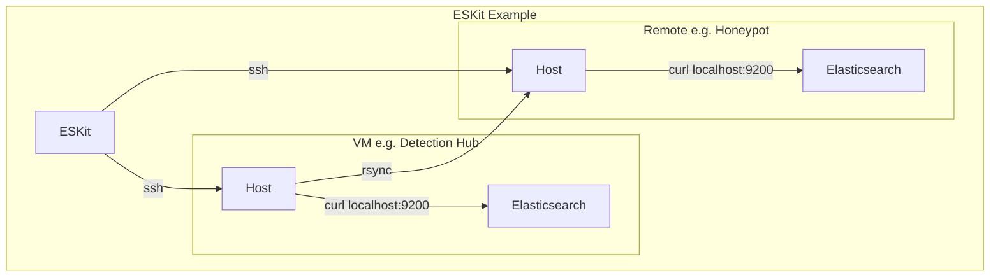

# ESKit

ESKit is a lightweight command-line toolkit for managing Elasticsearch repositories, snapshots, indices, and reindex operations across multiple environments.

It is designed for operators who regularly work with snapshot-based backup and restore workflows and want a simple, cache-driven interface instead of repeatedly typing Elasticsearch API requests.

> **Status:** Work in Progress (WIP)
>
> Core snapshot and index management workflows are operational and actively used. Rsync-based repository synchronization is still under development.

---

## Why ESKit?

Managing Elasticsearch snapshots often involves repetitive API calls:

* List repositories
* List snapshots
* Create snapshots
* Restore snapshots
* Delete indices
* Reindex data
* Check restore progress

ESKit provides a consistent CLI workflow:

1. Pull cluster metadata into a local cache
2. Browse repositories, snapshots, and indices locally
3. Execute Elasticsearch operations through SSH
4. Track long-running jobs such as reindex tasks

---

## Features

### Repository Management

* Create snapshot repositories
* Delete repositories
* View repository configuration
* Browse cached repository information

### Snapshot Management

* Create snapshots
* Delete snapshots
* Restore snapshots
* View snapshot details
* Browse cached snapshot metadata

### Index Management

* Create indices
* Delete indices
* View mappings and settings
* Browse cached index information

### Reindex Operations

* Start asynchronous reindex jobs
* Store job metadata locally
* Track Elasticsearch task IDs

### Cache System

ESKit maintains a local cache for:

* Repositories
* Snapshots
* Indices

This allows fast inspection without repeatedly querying Elasticsearch.

### Views and Field Projection

Output can be customized using reusable views defined in the configuration file.

Examples:

```bash
eskit cat index --view basic
eskit repo-show backup-repo --view summary
eskit index-show logs-2026.06 --fields mappings.properties
```

---

## Architecture

ESKit communicates with Elasticsearch through SSH.


- No Elasticsearch Python client is required.
- API requests are executed remotely using curl to localhost.
- No TLS required on Elasticsearch

---

## Installation

Clone the repository:

```bash
git clone <repo-url>
cd eskit
```

Install dependencies:

```bash
pip install paramiko
```

---

## Configuration

Create:

```text
.eskit/config.json
```

Example:

```json
{
  "hosts": [
    {
      "name": "prod",
      "ip": "10.0.0.10",
      "push-protected": true,
      "ssh": {
        "user": "elastic",
        "identity": "~/.ssh/id_ed25519"
      }
    }
  ]
}
```

---

## Quick Start

### Select a Host

```bash
eskit host
eskit host-set prod
eskit host-get
```

### Pull Metadata

```bash
eskit pull
```

This updates the local cache:

```text
.eskit/
└── prod/
    └── cache/
        ├── indices.json
        ├── repos.json
        └── snapshots.json
```

---

## Repository Workflow

Create a repository:

```bash
eskit repo-create backup-repo \
  --location /data/snapshots
```

Show repository information:

```bash
eskit repo-show backup-repo
```

Delete a repository:

```bash
eskit repo-delete backup-repo
```

---

## Snapshot Workflow

Create a snapshot:

```bash
eskit snap-create backup-repo/nightly-2026.06.01
```

Restore a snapshot:

```bash
eskit snap-restore backup-repo/nightly-2026.06.01
```

Delete a snapshot:

```bash
eskit snap-delete backup-repo/nightly-2026.06.01
```

---

## Index Workflow

Create an index:

```bash
eskit index-create test-index
```

Delete an index:

```bash
eskit index-delete test-index
```

Show index information:

```bash
eskit index-show test-index
```

---

## Reindex Workflow

Start a reindex operation:

```bash
eskit reindex source-index destination-index
```

Check jobs:

```bash
eskit job-list
```

Show a job:

```bash
eskit job-show reindex-destination-index-123abc
```

Check Elasticsearch task status:

```bash
eskit task-get <task-id>
```

---

## Output Views

Views allow reusable output projections.

Example:

```json
{
  "views": {
    "snapshot-basic": [
      "snapshot",
      "state",
      "start_time",
      "end_time"
    ]
  }
}
```

Usage:

```bash
eskit cat snap --view snapshot-basic
```

Multiple views may be specified:

```bash
eskit cat snap \
  --view snapshot-basic \
  --view snapshot-stats
```

Additional fields can be included:

```bash
eskit cat snap \
  --view snapshot-basic \
  --fields duration_in_millis
```

---

## Safety Features

### Push Protection

Hosts may be marked as protected:

```json
{
  "name": "prod",
  "push-protected": true
}
```

Mutating operations require:

```bash
--push
```

Example:

```bash
eskit repo-create backup-repo \
  --push
```

### Dry Run

Preview requests without executing them:

```bash
eskit snap-create backup-repo/test \
  --dry-run
```

### Delete Confirmation

Destructive operations require confirmation unless:

```bash
--force
```

is specified.

---

## Current Limitations

* Rsync workflow is still under development
* Job tracking is currently focused on reindex operations
* No automatic polling of Elasticsearch task completion
* Single-user local cache model

---

## Project Goals

ESKit is intended to remain:

* Lightweight
* Scriptable
* SSH-first
* Dependency-light
* Focused on operational workflows rather than full Elasticsearch administration

The goal is not to replace Kibana or official Elasticsearch tooling, but to provide a fast command-line workflow for snapshot, restore, and migration tasks.
