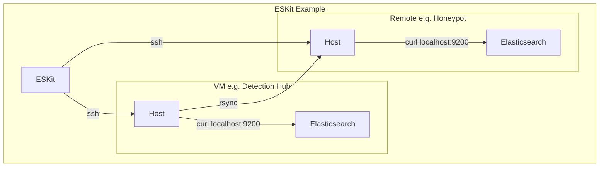

# ESKit

ESKit is a lightweight command-line toolkit for managing Elasticsearch repositories, snapshots, indices, and reindex operations across multiple environments.

It is designed for operators who regularly work with snapshot-based backup and restore workflows and want a simple, cache-driven interface instead of repeatedly typing Elasticsearch API requests.

> --Status:-- Work in Progress (WIP)
>
> Core snapshot and index management workflows are operational and actively used. Rsync-based repository synchronization is still under development.

---

## Why ESKit?

Managing Elasticsearch snapshots often involves repetitive API calls:

- List repositories
- List snapshots
- Create snapshots
- Restore snapshots
- Delete indices
- Reindex data
- Check restore progress

ESKit provides a consistent CLI workflow:

1. Pull cluster metadata into a local cache
2. Browse repositories, snapshots, and indices locally
3. Execute Elasticsearch operations through SSH
4. Track long-running jobs such as reindex tasks

---

## Features

### Repository Management

- Create snapshot repositories
- Delete repositories
- View repository configuration
- Browse cached repository information

### Snapshot Management

- Create snapshots
- Delete snapshots
- Restore snapshots
- View snapshot details
- Browse cached snapshot metadata

### Index Management

- Create indices
- Delete indices
- View mappings and settings
- Browse cached index information

### Reindex Operations

- Start asynchronous reindex jobs
- Store job metadata locally
- Track Elasticsearch task IDs

### Cache System

ESKit maintains a local cache for:

- Repositories
- Snapshots
- Indices

This allows fast inspection without repeatedly querying Elasticsearch.

### Views and Field Projection

Output can be customized using reusable views defined in the configuration file.

Examples:

```bash
eskit cat index --view basic
eskit repo show backup-repo --view summary
eskit index show logs-2026.06 --fields mappings.properties
```

---

## Architecture

ESKit communicates with Elasticsearch through SSH.


- No Elasticsearch Python client is required.
- API requests are executed remotely using curl to localhost.
- No TLS required on Elasticsearch

---

## Installation

Clone the repository:

```bash
git clone <repo-url>
cd eskit
```

Install dependencies:

```bash
pip install paramiko
```

Running:

```bash
python eskit.py --help
```
```bash
python eskit.py init --demo
```

---

## Quick Demo
```bash
git clone ...
cd eskit

pip install paramiko

python eskit.py init --demo
python eskit.py status
python eskit.py cat repo
```

---

## Command Overview

#### Initialize ESKit

```bash
eskit init
```

This creates an initial config file.

#### Initialize Demo
```bash
eskit init --demo
```

This initializes with demo cache file to explore the tool.
Please see DEMO for more details.

### Select a Host

```bash
eskit host show
eskit host set prod
eskit host get
```

### Show ESKit Status

```bash
eskit status
```
- Data Source: Config | Cache
This commands shows the host information including elasticsearch cluster information in cache.

### Pull Metadata

```bash
eskit pull
```
- Data Source: Elasticsearch

This updates the local cache:

```text
.eskit/
└── prod/
    └── cache/
        ├── indices.json
        ├── repos.json
        ├── snapshots.json
        └── version.json
```

---

## View Metadata
```bash
eskit cat <repo/snap/index>
```
- Data Source: Cache
- Operation Type: View

This shows the metadata in cache.

## Repository Workflow

Create a repository:

```bash
eskit repo create backup-repo \
  --location /data/snapshots
```
- Data Destination: Elasticsearch
- Operation Type: Mutating

Show repository or snapshot information:

```bash
eskit repo show backup-repo
eskit repo show backup-repo/snapshot1
```
- Data Source: Cache
- Operation Type: View

Delete a repository:

```bash
eskit repo delete backup-repo
```
- Data Destination: Elasticsearch
- Operation Type: Mutating | Destructive

---

## Snapshot Workflow

Create a snapshot:

```bash
eskit snap create backup-repo/nightly-2026.06.01
```
- Data Destination: Elasticsearch
- Operation Type: Mutating

Restore a snapshot:

```bash
eskit snap restore backup-repo/nightly-2026.06.01
```
- Data Destination: Elasticsearch
- Operation Type: Mutating

Delete a snapshot:

```bash
eskit snap delete backup-repo/nightly-2026.06.01
```
- Data Destination: Elasticsearch
- Operation Type: Mutating | Destructive

---

## Index Workflow

Create an index:

```bash
eskit index create test-index
```
- Data Destination: Elasticsearch
- Operation Type: Mutating

Delete an index:

```bash
eskit index delete test-index
```
- Data Destination: Elasticsearch
- Operation Type: Mutating | Destructive

Show index information:

```bash
eskit index show test-index
```
- Data Source: Elasticsearch
- Operation Type: View

---

## Reindex Workflow

Start a reindex operation:

```bash
eskit reindex source-index destination-index
```
- Data Source: Elasticsearch
- Operation Type: Mutating

Check jobs:

```bash
eskit job list
```
- Data Source: Cache
- Operation Type: View

Show a job:

```bash
eskit job show <job-id>
```
- Data Source: Cache
- Operation Type: View

Check Elasticsearch task status:

```bash
eskit task get <task-id>
```
- Data Source: Elasticsearch
- Operation Type: View

---

## Output Views

Views provide reusable output projections for commands that return metadata.

Example:

```json
{
  "views": {
    "snapshot-basic": [
      "snapshot",
      "state",
      "start_time",
      "end_time"
    ]
  }
}
```

Usage:

```bash
eskit cat snap --view snapshot-basic
```

Multiple views may be specified:

```bash
eskit cat snap \
  --view snapshot-basic \
  --view snapshot-stats
```

Additional fields can be included:

```bash
eskit cat snap \
  --view snapshot-basic \
  --fields duration_in_millis
```

---

## Safety Features

### Push Protection

Hosts may be marked as protected:

```json
{
  "name": "prod",
  "push-protected": true
}
```

Mutating operations require:

```bash
--push
```

Example:

```bash
eskit repo create backup-repo \
  --push
```

### Dry Run

Preview requests without executing them:

```bash
eskit snap create backup-repo/test \
  --dry-run
```

### Delete Confirmation

Destructive operations require confirmation unless:

```bash
--force
```

is specified.

---

## Configuration

Create:

```text
.eskit/config.json
```

Example:

```json
{
  "hosts": [
    {
      "name": "prod",
      "ip": "10.0.0.10",
      "push-protected": true,
      "ssh": {
        "user": "elastic",
        "identity": "~/.ssh/id_ed25519"
      }
    }
  ]
}
```

---

## Current Limitations
- Snapshot compatibility validation is not currently performed automatically.
- Restores between Elasticsearch versions must be validated by the operator.
- Rsync workflow is still under development
- Job tracking is currently focused on reindex operations
- No automatic polling of Elasticsearch task completion
- Single-user local cache model
- Currently this tool has tested with Elasticsearch/Kibana version of 
- Project-local configuration and cache model (.eskit)

---

## SSH Login

This tool supports connecting to hosts with SSH by using paramiko. Currently it supports:
- Key authentication
- Password autentication

For the key authentication, it support SSH-Agent, Run-Time passphrase prompt (Ed25519Key only), or unencrypted key. It's highly recommend to utilize SSH-Agent to avoid repeated passphrase prompts. 

For password authentication, it currently does not support environement variable, so the passwords need to be in the config file. This is intended primarily for lab and development environments.

---

## Future Updates and Improvements
- Local host support - running commands without SSH when running the tool on elasticsearch host itself 
- Complete Rsync workflo
- Job tracking and updates
- Streaming output support - being able to monitor long running operations or docker log command support. 
- Shell interactive mode

---

## Project Goals

ESKit is intended to remain:

- Lightweight
- Scriptable
- SSH-first
- Dependency-light
- Focused on operational workflows rather than full Elasticsearch administration

The goal is not to replace Kibana or official Elasticsearch tooling, but to provide a fast command-line workflow for snapshot, restore, and migration tasks.
